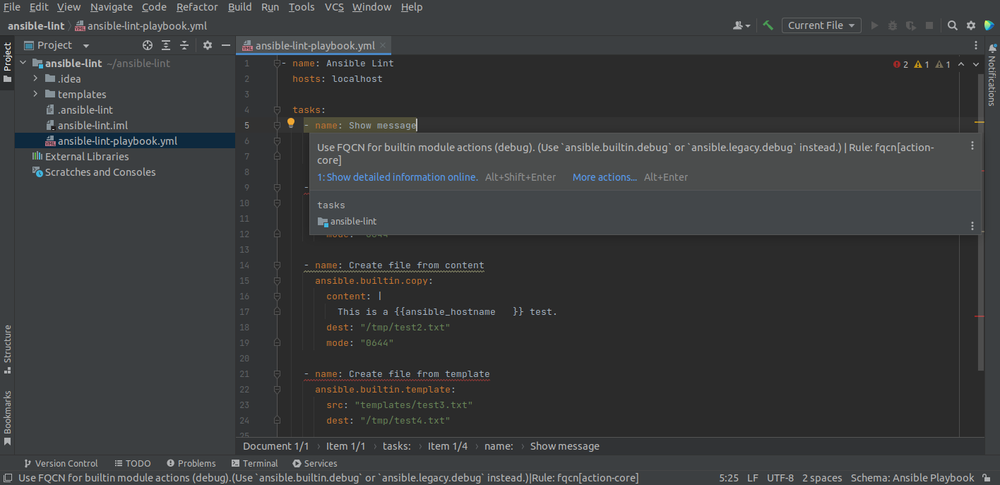
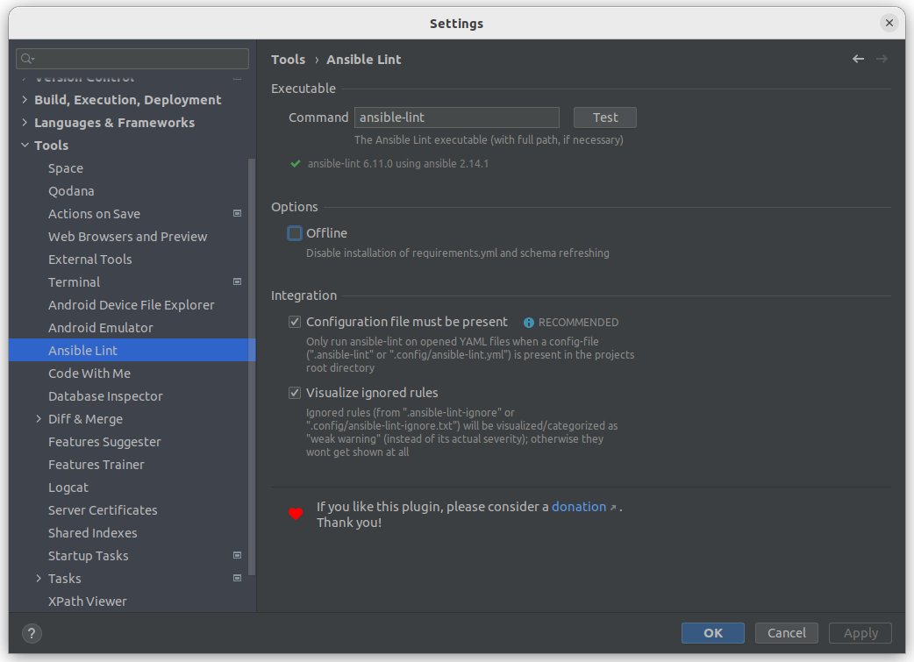

#  IntelliJ Ansible Lint

> A plugin for the IntelliJ platform utilizing [Ansible Lint](https://ansible-lint.readthedocs.io/).

## Table of Contents

* [Screenshots](#screenshots)
* [Requirements](#requirements)
* [Installation](#installation)
* [Setup](#setup)
* [License](#license)
* [Credits](#credits)
* [Donate](#donate) :heart:

## Screenshots

#### Annotations on all tasks with issues:


#### Concrete details on mouseover:



#### Different visualization based on severity:


#### Quick actions:


#### Security relevant information:


## Requirements

Your system needs to have [Ansible Lint](https://github.com/ansible/ansible-lint) version `6.14.3` (or later) installed.  
(Previous versions should work; but may not provide optimal/expected results.)

_NOTE_

The plugin **does not** detect or use any (virtual) environment settings of your current project to run `ansible-lint`.  
Alternative installation methods (like [Poetry](https://python-poetry.org/), [Homebrew](https://brew.sh), etc.) are also not supported.

`ansible-lint` needs to be runnable directly from your computer's command line.

If your package manager doesn't provide `ansible-lint` or you want to install a more up-to-date version, then a suggested setup would be as follows:

_NOTE_ 

This will result in ansbile-lint using the latest version of ansible supported by ansible-lint. If you need a specific version of ansible see [Pipx](#pipx) instructions below
* create an `ansible-lint` folder in your home directory:
  ```
  mkdir ~/ansible-lint
  ```

* change into it, and create a dedicated virtual environment:
  ```
  cd ~/ansible-lint
  python3 -m venv venv
  ```

* activate the virtual environment and install `ansible-lint` via `pip`:
  ```
  source venv/bin/activate
  pip install ansible-lint
  ```

* finally, create this script file (`~/ansible-lint/run.sh`):
  ```
  #!/bin/bash
  source ~/ansible-lint/venv/bin/activate
  ansible-lint ${@}
  ```

* don't forget to make it executable:
  ```
  chmod +x ~/ansible-lint/run.sh
  ```

Reference this script in the plugin; and you should be ready to go. 👍

## Pipx

Pipx can be used as an alternative to manually configuring a venv. It has the advantage of automatically adding the installed binaries to your path and allows specifying the ansible verion ansible-lint uses

* Remove apt installed ansible
  ```
  sudo apt remove ansible*
  ```

* Install [Pipx](https://pipx.pypa.io/stable/installation/)
  
* Install ansible with pipx (change 6.7.0 to your required version, or remove it to install the latest)
  ```
  pipx install --include-deps ansible==6.7.0
  ```

* Inject ansible-lint into the pipx ansible venv 
  ```
  pipx inject --include-deps ansible ansible-lint
  ```

`ansible` and `ansible-lint` should now be availible in your path

## Installation

Use the IDE's built-in plugin system:

* `File` --> `Settings...` --> `Plugins` --> `Marketplace`
* search for: `Ansible Lint`
* click the `Install`-button

Or go to the [plugin page](https://plugins.jetbrains.com/plugin/20905-ansible-lint) on the [JetBrains](https://www.jetbrains.com)-website, download the archive-file and install manually.

## Setup

After installing the plugin you should go to the settings dialog and hit the `Test` button to check if `ansible-lint` is fully operable.



Adjust the command path and/or options as needed.

:warning: NOTE

By default, the plugin will only start linting YAML-files if your project root contains one of these [configuration files](https://ansible-lint.readthedocs.io/configuring/#using-local-configuration-files):

* `.ansible-lint`
* `.config/ansible-lint.yml`

You can eiter create one manually or use the statusbar pop-up actions; which will be available when a YAML file is opened (and no config file is present):


It is possible to use the plugin without a config file (see settings dialog above).
However, this would mean that **every** YAML-file will unnecessarily be passed to `ansible-lint`; even in Non-Ansible projects.

## License

Please read the [license](LICENSE) file.

## Credits

* _Ansible_ logo - [simpleicons.org](https://simpleicons.org/?q=ansible)
* _Check_ pictogram - [Bootstrap Icons](https://icons.getbootstrap.com/icons/check-circle-fill/)
* _Heart_ icon - [FontAwesome](https://fontawesome.com/icons/heart?s=solid&f=classic)

## Donate

If you like this plugin, please consider a [donation](https://paypal.me/AchimSeufert). Thank you!
