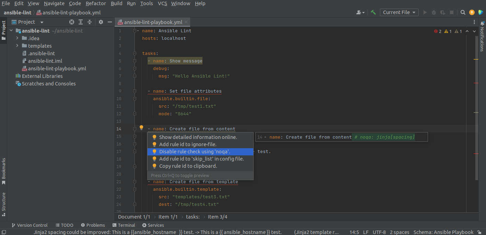

#  IntelliJ Ansible Lint

> A plugin for the IntelliJ platform utilizing [Ansible Lint](https://ansible-lint.readthedocs.io/).

## Table of Contents

* [Screenshots](#screenshots)
* [Requirements](#requirements)
* [Installation](#installation)
* [Setup](#setup)
* [License](#license)
* [Credits](#credits)
* [Donate](#donate) :heart:

## Screenshots

#### Annotations on all tasks with issues:

> 

#### Concrete details on mouseover:

> 

#### Different visualization based on severity:

> 

#### Quick actions:

> 

> 

#### Security relevant information:

> 

## Requirements

Your system needs to have [Ansible Lint](https://github.com/ansible/ansible-lint) version `6.11.0` (or later) installed.

## Installation

Use the IDE's built-in plugin system:

* `File` --> `Settings...` --> `Plugins` --> `Marketplace`
* search for: `Ansible Lint`
* click the `Install`-button

Or go to the [plugin page](https://plugins.jetbrains.com/plugin/20905-ansible-lint) on the [JetBrains](https://www.jetbrains.com)-website, download the archive-file and install manually.

## Setup

After installing the plugin you should go to the settings dialog and hit the `Test` button to check if `ansible-lint` is fully operable.

> 

Adjust the command path and/or options as needed.

:warning: NOTE

By default, the plugin will only start linting YAML-files if your project root contains one of these [configuration files](https://ansible-lint.readthedocs.io/configuring/#using-local-configuration-files):

* `.ansible-lint`
* `.config/ansible-lint.yml`

You can eiter create one manually or use the statusbar pop-up actions; which will be available when a YAML file is opened (and no config file is present):

> 

It is possible to use the plugin without a config file (see settings dialog above).
However, this would mean that **every** YAML-file will unnecessarily be passed to `ansible-lint`; even in Non-Ansible projects.

## License

Please read the [license](LICENSE) file.

## Credits

* _Ansible_ logo - [simpleicons.org](https://simpleicons.org/?q=ansible)
* _Check_ pictogram - [Bootstrap Icons](https://icons.getbootstrap.com/icons/check-circle-fill/)
* _Heart_ icon - [FontAwesome](https://fontawesome.com/icons/heart?s=solid&f=classic)

## Donate

If you like this plugin, please consider a [donation](https://paypal.me/AchimSeufert). Thank you!
